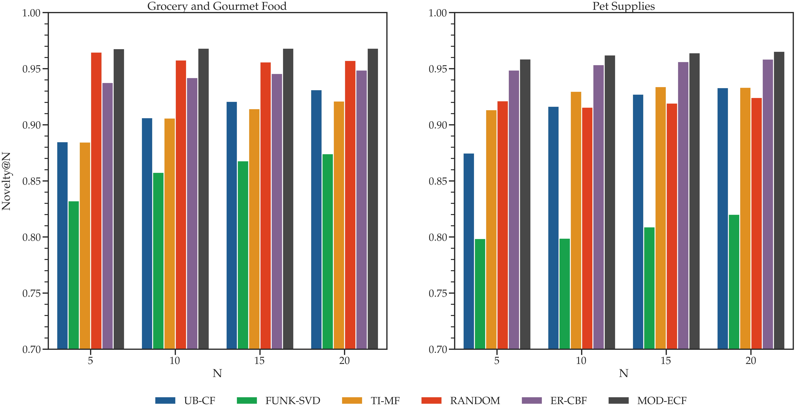

Leveraging Unsupervised Representation Learning with Reviews to Improve Top-N Recommendation in E-commerce
==============================

## Table of Contents
1. [Abstract](#abstract)
2. [Requirements](#requirements)
3. [Getting Started](#getting-started)
    * [Generate Recommendations w/ CLI](#generate-recommendations-w-cli)
    * [Experimental Setup w/ Notebook](#experimental-setup-w-notebook)
4. [Project Overview](#project-overview)
    * [Dataset](#dataset)
    * [Data Understanding and Preparation](#data-understanding-and-preparation)
    * [Proposed Approaches](#proposed-approaches)
    * [Findings](#findings)
    * [Web Application Demo](#web-application-demo)
    * [Conclusion and Future Work](#conclusion-and-future-work)
5. [Project Organisation](#project-organisation)

## Abstract


Traditional recommender systems in E-commerce leverage algorithms such as collaborative filtering to recommend personalised products to users solely based on product ratings by deriving a user-item rating matrix. This arises in two main issues of data sparsity and cold start, which impacts the overall quality of recommendations given the rapid growth of modern E-commerce platforms in both the number of items and users present. The main contribution of this work is the formulation of two approaches, Embedded Review Content-based Filtering (ER-CBF) and Model-based Embedded Collaborative Filtering (MOD-ECF) that incorporates user-generated content such as reviews as both an independent and additional source of information in attempts to tackle concerns of recommendation quality. The unstructured text is represented as document-level embeddings in a continuous feature space of fixed length, using unsupervised representation learning, the Paragraph Vector model. Subsequently, user and item profiles are generated by aggregating the document embeddings on both user and item levels. The resulting representations are used independently in a content-based filtering approach and combined with product ratings in a matrix factorisation collaborative filtering algorithm.

The proposed methodologies are then compared to traditional recommendation algorithms in both accuracy and novelty. Experiments on two categories of a real-world E-commerce dataset demonstrated that ER-CBF outperformed the other systems in terms of accuracy by using only reviews as the sole information while achieving relative novelty. These results suggest that our approach can tackle common problems such as data sparsity and cold start found in traditional recommendation algorithms, thereby indicating the potential of our approach.

## Requirements

To run the project, we **highly** advised you create a virtual environment to self-contain the necessary dependencies required to generate recommendations.

To create a virtual environment `virtualenv`:

###### For Windows:
```console
py -m pip install --user virtualenv
py -m venv .venv
```

###### For Mac OS:
```console
python3 -m pip install --user virtualenv
python3 -m venv .venv
```

To activate the virtual environment `.venv`:

###### For Windows:
```console
source .\.venv\Scripts\activate

# check virtual environment activated
where python
```

###### For Mac OS:
```console
source .venv/bin/activate

# check virtual environment activated
which python
```

To install the necessary dependencies within `.venv`:

###### For Windows:
```console
py -m pip install -r requirements.txt
```

###### For Mac OS:
```console
python3 -m pip install -r requirements.txt
```

## Getting Started


To get the raw data, please visit: https://jmcauley.ucsd.edu/data/amazon/. In our project usage, we require 4 datasets, belonging to **TWO (2)** categories experimented:

> Place all downloaded raw data into the following directory, `data/raw`.

###### 5-core Reviews and Ratings:

1. Grocery and Gourmey Food (5-core): http://snap.stanford.edu/data/amazon/productGraph/categoryFiles/reviews_Grocery_and_Gourmet_Food_5.json.gz
2. Pet Supplies: http://snap.stanford.edu/data/amazon/productGraph/categoryFiles/reviews_Pet_Supplies_5.json.gz

###### Item Metadata:

1. Grocery and Gourmet Food: http://deepyeti.ucsd.edu/jianmo/amazon/metaFiles2/meta_Grocery_and_Gourmet_Food.json.gz
2. Pet Supplies: http://deepyeti.ucsd.edu/jianmo/amazon/metaFiles2/meta_Pet_Supplies.json.gz

In order to run the experiments setup of this project, ensure that following files are populated in their respective folders:
* `data/evaluation/Grocery_and_Gourmet_Food_train.csv`
* `data/evaluation/Grocery_and_Gourmet_Food_test.csv`
* `data/evaluation/Pet_Supplies_train.csv`
* `data/evaluation/Pet_Supplies_test.csv`
* `models/d2v/Grocery_and_Gourmet_Food_item_50_10_d2v.model`
* `models/d2v/Grocery_and_Gourmet_Food_user_item_50_10_d2v.model`
* `models/d2v/Pet_Supplies_item_50_10_d2v.model`
* `models/d2v/Pet_Supplies_user_item_50_10_d2v.model`
* `models/lda/Grocery_and_Gourmet_Food_lda.model`
* `models/lda/Pet_Supplies_lda.model`

If any of the files is **NOT** present, run the following commands to generate all the necessary data and models:
```bash
dvc repro --force
```
* NOTE: `dvc repro --force` by default will generate the files for `Grocery_and_Gourmet_Food`.

To generate the necessary data for `Pet_Supplies`, make the following change to the file `params.yaml`:
```yaml
prepare:
  categories:
    &a Pet_Supplies
```

* For the *lda* model, you can refer to the commented-out section `Preparing Topic Vectors [Train/Load]` in:
    * `03-lwt-updated-experimental-setup-ti-mf-ps` or
    * `09-lwt-updated-exprimentatl-setup-ti-mf-ggf`
* After generating the required *lda* model, ensure that you place the model under the directory `models/lda/{category}_lda.model`.

#### Generate Recommendations w/ `CLI`:

If you prefer working in the command line environment, run the following command to train a single algorithm and save the recommendations into a `SQLite` database:

```console
# python3 src/train.py --help
>> Usage: train.py [OPTIONS]

  Train recommender algorithms to generate top-N recommendation list.

Options:
  --category TEXT     Category for recommendations.  [required]
  --algorithm TEXT    Recommendation algorithms.  [required]
  --n INTEGER         N-number of items recommended.  [required]
  --epochs INTEGER    Number of training epochs.
  --lr FLOAT          Learning rate.
  --beta FLOAT        Regularisation rate.
  --input_path TEXT   Path to training dataset.
  --output_path TEXT  Path to save recommendations.
  --d2v_path TEXT     Path to trained doc2vec model.
  --lda_path TEXT     Path to trained LDA model.
  --help              Show this message and exit.

# EXAMPLES:
# top-10 recommendations for pet supplies, using ER-CBF
# only first two args is necessarily, the rest are optional, with default path set
python3 src/train.py \
--category=Pet_Supplies \
--algorithm=er-cbf \
--n=10

# top-5 recommendations for grocery and gourmet food, using TI-MF
python3 src/train.py \
--category=Grocery_and_Gourmet_Food \
--algorithm=ti-mf \
--n=5 \
--epochs=5 \
--lr=0.005 \
--beta=0.1
```
The arguments for the `train.py` script:

* `CATEGORY`: Category to generate recommendations for, e.g., [`Pet_Supplies`, `Grocery_and_Gourmet_Food`]
* `ALGORITHM`: Selecting the algorithms to generate recommendations, e.g., [`er-cbf`, `mod-ecf`, `ti-mf`, `funk-svd`, `ub-cf`]
* `N`: *N*-number of items to be recommended for each users
* `EPOCHS`: Number of training epochs, default to `5`
* `LR`: The learning rate for the algorithm (Matrix Factorisation-based), defaults to `0.005`
* `BETA`: The regularisation rate (Matrix Factorisation-based), defaults to `0.1`
* `INPUT_PATH`: Path containing train and  test datasets, defaults to `data/evaluation`
* `OUTPUT_PATH`: Path to create and save *SQLite* database containing recommendations, defaults to `./`
* `D2V_PATH`: Path containing trained and serialised Paragraph Vector (doc2vec) model, defaults to `models/d2v`
* `LDA_PATH`: Path containing trained and serialised LDA model, defaults to `models/lda`

#### Experimental Setup w/ `Notebook`:

When all files are verified to be in the respective folders, you may run the following **TWELVE (12)** experimental notebooks, each documenting the recommendation process for a specific algorithm (e.g., `UB-CF`) in a one of two categories (`Pet_Supplies` or `Grocery_and_Gourmet_Food`).

> Experimental setup consists of metric evaluation of `Recall@N` (overall & cold-start users) and `Novelty@N` (overall users).

A brief description of the notebooks (`.ipynb`) are detailed as the following:

###### For Pet Supplies:
1. `01-lwt-experiment-setup-ub-cf-ps`: User-based Collaborative Filtering.
2. `02-lwt-experiment-setup-funk-svd-ps`: Funk's Matrix Factorisation.
3. `03-lwt-experiment-setup-ti-mf-ps`: Topic-Initialised Matrix Factorisation.
4. `04-lwt-experiment-setup-random-ps`: Random Normal Rating Prediction.
5. `05-lwt-experiment-setup-er-cbf-ps`: (*Proposed*) Embedded Review Content-based Filtering.
6. `06-lwt-experiment-setup-mod-ecf-ps`: (*Proposed*) Model-based Embedded Collborative Filtering.

###### For Grocery and Gourmet food
7. `07-lwt-experiment-setup-ub-cf-ggf`: User-based Collaborative Filtering.
8. `08-lwt-experiment-setup-funk-svd-ggf`: Funk's Matrix Factorisation.
9. `09-lwt-experiment-setup-ti-mif-ggf`: Topic-Initialised Matrix Factorisation.
10. `10-lwt-experiment-setup-random-ggf`: Random Normal Rating Prediction.
11. `11-lwt-experiment-setup-er-cbf-ggf`: (*Proposed*) Embedded Review Content-based Filtering.
12. `12-lwt-experiment-setup-mod-ecf-ggf`: (*Proposed*) Model-based Embedded Collaborative Filtering.

To execute each experimental setup, simply select under the menu ribbon: `Kernel` -> `Restart & Run All`.
* Note: If you do not with to overwrite any existing saved top-N recommendation lists in `./recommender.db`, simply comment out the code under the section: `Store in SQLite DB`.

## Project Overview

### Dataset
------------

Lorem ipsum dolor sit amet, consectetur adipiscing elit. Nunc posuere ipsum ligula, non euismod justo vulputate et. Vestibulum in pharetra est. Sed faucibus, lorem vitae facilisis facilisis, velit risus rutrum nibh, id auctor turpis est at augue. Sed ac dignissim orci. Mauris in felis aliquam, interdum mauris quis, ornare neque. Donec magna dui, auctor id enim non, dignissim malesuada mi. Etiam et purus vehicula dolor scelerisque molestie. Curabitur finibus urna eget tristique congue.

### Data Understanding and Preparation
------------

#### 1. Data Understanding


Lorem ipsum dolor sit amet, consectetur adipiscing elit. Nunc posuere ipsum ligula, non euismod justo vulputate et. Vestibulum in pharetra est. Sed faucibus, lorem vitae facilisis facilisis, velit risus rutrum nibh, id auctor turpis est at augue. Sed ac dignissim orci. Mauris in felis aliquam, interdum mauris quis, ornare neque. Donec magna dui, auctor id enim non, dignissim malesuada mi. Etiam et purus vehicula dolor scelerisque molestie. Curabitur finibus urna eget tristique congue.


#### 2. Data Preparation


Lorem ipsum dolor sit amet, consectetur adipiscing elit. Nunc posuere ipsum ligula, non euismod justo vulputate et. Vestibulum in pharetra est. Sed faucibus, lorem vitae facilisis facilisis, velit risus rutrum nibh, id auctor turpis est at augue. Sed ac dignissim orci. Mauris in felis aliquam, interdum mauris quis, ornare neque. Donec magna dui, auctor id enim non, dignissim malesuada mi. Etiam et purus vehicula dolor scelerisque molestie. Curabitur finibus urna eget tristique congue.

### Proposed Approaches
------------


Lorem ipsum dolor sit amet, consectetur adipiscing elit. Nunc posuere ipsum ligula, non euismod justo vulputate et. Vestibulum in pharetra est. Sed faucibus, lorem vitae facilisis facilisis, velit risus rutrum nibh, id auctor turpis est at augue. Sed ac dignissim orci. Mauris in felis aliquam, interdum mauris quis, ornare neque. Donec magna dui, auctor id enim non, dignissim malesuada mi. Etiam et purus vehicula dolor scelerisque molestie. Curabitur finibus urna eget tristique congue.

### Findings
------------

#### 1. `Recall@N` for Overall Users


Lorem ipsum dolor sit amet, consectetur adipiscing elit. Nunc posuere ipsum ligula, non euismod justo vulputate et. Vestibulum in pharetra est. Sed faucibus, lorem vitae facilisis facilisis, velit risus rutrum nibh, id auctor turpis est at augue. Sed ac dignissim orci. Mauris in felis aliquam, interdum mauris quis, ornare neque. Donec magna dui, auctor id enim non, dignissim malesuada mi. Etiam et purus vehicula dolor scelerisque molestie. Curabitur finibus urna eget tristique congue.

#### 2. `Novelty@N` for Overall Users



Lorem ipsum dolor sit amet, consectetur adipiscing elit. Nunc posuere ipsum ligula, non euismod justo vulputate et. Vestibulum in pharetra est. Sed faucibus, lorem vitae facilisis facilisis, velit risus rutrum nibh, id auctor turpis est at augue. Sed ac dignissim orci. Mauris in felis aliquam, interdum mauris quis, ornare neque. Donec magna dui, auctor id enim non, dignissim malesuada mi. Etiam et purus vehicula dolor scelerisque molestie. Curabitur finibus urna eget tristique congue.

#### 3. `Recall@N` for Cold-start Users


Lorem ipsum dolor sit amet, consectetur adipiscing elit. Nunc posuere ipsum ligula, non euismod justo vulputate et. Vestibulum in pharetra est. Sed faucibus, lorem vitae facilisis facilisis, velit risus rutrum nibh, id auctor turpis est at augue. Sed ac dignissim orci. Mauris in felis aliquam, interdum mauris quis, ornare neque. Donec magna dui, auctor id enim non, dignissim malesuada mi. Etiam et purus vehicula dolor scelerisque molestie. Curabitur finibus urna eget tristique congue.

### Web Application Demo
------------

<p align="center">
    
</p>

Lorem ipsum dolor sit amet, consectetur adipiscing elit. Nunc posuere ipsum ligula, non euismod justo vulputate et. Vestibulum in pharetra est. Sed faucibus, lorem vitae facilisis facilisis, velit risus rutrum nibh, id auctor turpis est at augue. Sed ac dignissim orci. Mauris in felis aliquam, interdum mauris quis, ornare neque. Donec magna dui, auctor id enim non, dignissim malesuada mi. Etiam et purus vehicula dolor scelerisque molestie. Curabitur finibus urna eget tristique congue.

The Streamlit web application can be accessed at: https://share.streamlit.io/wtlow003/recommendation-systems/main/app.py

### Conclusion and Future Work
------------

Lorem ipsum dolor sit amet, consectetur adipiscing elit. Nunc posuere ipsum ligula, non euismod justo vulputate et. Vestibulum in pharetra est. Sed faucibus, lorem vitae facilisis facilisis, velit risus rutrum nibh, id auctor turpis est at augue. Sed ac dignissim orci. Mauris in felis aliquam, interdum mauris quis, ornare neque. Donec magna dui, auctor id enim non, dignissim malesuada mi. Etiam et purus vehicula dolor scelerisque molestie. Curabitur finibus urna eget tristique congue.

Project Organisation
------------

    ├── LICENSE
    ├── README.md          <- The top-level README for developers using this project.
    ├── data
    │   ├── external       <- Data from third party sources.
    │   ├── interim        <- Intermediate data that has been transformed, combining transaction log and item information.
    │   ├── processed      <- The final, canonical data sets for modeling.
    │   ├── evaluation     <- The train, test split of the final dataset used to train the models and test the predictions.
    │   └── raw            <- The original, immutable data dump. As file is too big, I have provided the
    │                         link to download the raw data seperately in the `data_instruction.txt`.
    │
    │
    ├── models             <- Trained and serialized models, model predictions, or model summaries
    │   └── d2v            <- Trained and serialized Paragraph Vector model (Gensim's `Doc2Vec`).
    │   └── lda            <- Trained and serialized Latent Dirchlet Allocaton (Gensim's `ldamodel`).
    │
    │
    ├── notebooks
    │   └── exploratory    <- Jupyter notebooks for initial exploration. Naming convention is a
    │                         number (for ordering), the creator's initials, and a short `-`
    │                         delimited description, e.g. `1.0-jqp-initial-data-exploration`.
    │
    │
    ├── reports
    │   └── figures        <- Generated graphics and figures for illustrating concepts.
    │   └── metrics        <- Generated graphics and figures for reporting metrics.
    │
    ├── requirements.txt   <- The requirements file for reproducing the analysis environment, e.g.
    │                         generated with `pip freeze > requirements.txt`
    │
    ├── src                <- Source code for use in this project.
    │   ├── __init__.py    <- Makes src a Python module
    │   │
    │   ├── data           <- Functions to load, transform, and split raw/merged data.
    │   │   └── evaluate.py
    │   │   └── load_dataset.py
    │   │   └── make_dataset.py
    │   │
    │   ├── features       <- Functions to turn raw data into features for modeling
    │   │   └── build_features.py
    │   │
    │   ├── models         <- Functions to train models and then use trained models to make
    │   │   │                 predictions
    │   │   ├── algorithms.py
    │   │   └── evaluate_model.py
    │   │   └── lda.py
    │   │
    │   └── utilities      <- Functions for miscellaneous tasks, e.g. aggregating document embeddings etc.
    │       └── utilities.py
    │
    ├── presentation       <- Slides used for oral presentation.
    │
    └── literatures        <- Papers cited in the literature review.


--------

<p><small>Project based on the <a target="_blank" href="https://drivendata.github.io/cookiecutter-data-science/">cookiecutter data science project template</a>. #cookiecutterdatascience</small></p>
